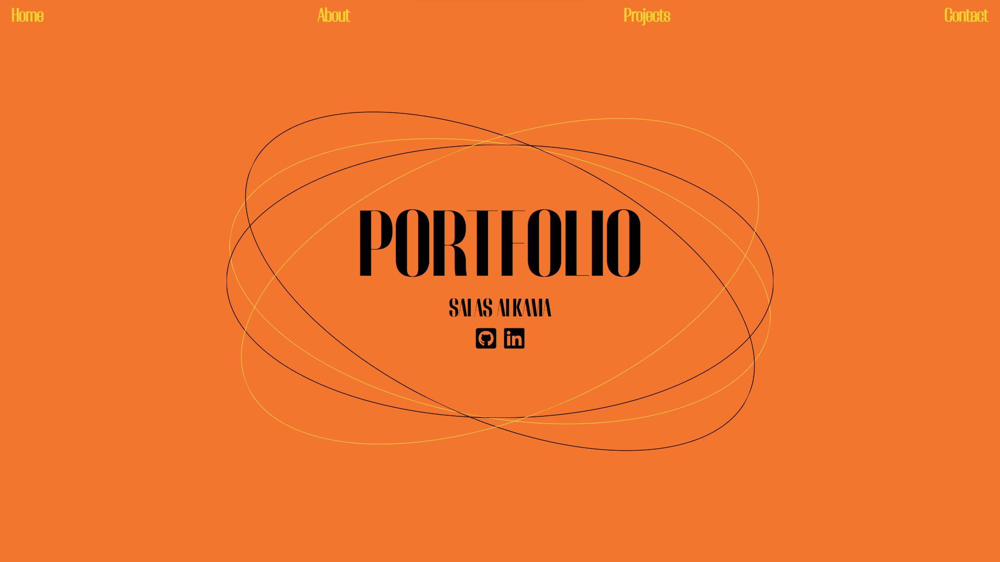

# Portfolio de Salas Alkama

Bienvenue sur mon portfolio personnel ! Ce projet a été entièrement conçu par moi-même, y compris la conception graphique, pour mettre en avant mes compétences, projets et expériences en développement web et logiciel.

## Technologies Utilisées

Ce portfolio a été construit en utilisant les technologies suivantes :

- React : Une bibliothèque JavaScript pour la création d'interfaces utilisateur.
- Framer Motion : Une bibliothèque pour les animations en React.
- React Router : Pour la gestion des routes et de la navigation.
- HTML & CSS : Pour la structure et la mise en page.
- Autres bibliothèques et dépendances : Consultez le fichier `package.json` pour la liste complète.

## Structure du Projet

Le projet est organisé de la manière suivante :

- `src/Components` : Contient les composants React réutilisables.
- `src/images` : Stocke les images et médias utilisés dans le projet.
- `src/App.js` : Le point d'entrée principal de l'application.
- `src/index.js` : Le fichier d'initialisation de l'application React.
- `src/App.css` : Les styles globaux de l'application.

## Exécution du Projet

1. Assurez-vous d'avoir Node.js installé sur votre système.
2. Clonez ce dépôt sur votre machine locale.
3. Ouvrez un terminal dans le répertoire du projet et exécutez `npm install` pour installer les dépendances.
4. Ensuite, exécutez `npm start` pour lancer l'application en mode développement.
5. Ouvrez votre navigateur et accédez à [http://localhost:3000](http://localhost:3000) pour voir le portfolio en action.

## Auteur

- Salas Alkama
- GitHub : [https://github.com/salasss](https://github.com/salasss)
- LinkedIn : [https://www.linkedin.com/in/salas-alkama](https://www.linkedin.com/in/salas-alkama)

N'hésitez pas à me contacter si vous avez des questions ou des commentaires !

---

© 2023 Salas Alkama. Tous droits réservés.
